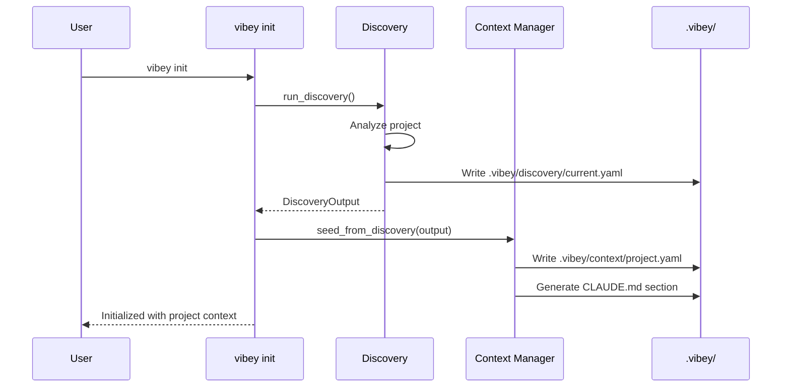

# Discovery-to-Context Integration Design

**Version:** 1.0.0
**Sprint:** Phase 4.2 - Discovery Output Architecture
**Task:** Task 3 - Design discovery-to-context integration

---

## Overview

This document defines how discovery outputs integrate with the context management system. Discovery provides project understanding; context management makes that understanding available to AI agents and CLI commands.

### Key Integration Points

1. **Context Seeding** - Initialize context from discovery on project setup
2. **Refresh Triggers** - Automatically re-run discovery when project changes
3. **Staleness Detection** - Identify when discovery data is outdated
4. **Context Correlation** - Link discovery versions to sessions

---

## 1. Context Seeding

### 1.1 Workflow: Project Initialization

When a new project is initialized with Vibey, discovery runs automatically to seed context.



### 1.2 Context Files Generated

When discovery runs, the following context files are created/updated:

```
.vibey/
├── discovery/
│   ├── current.yaml              # Full discovery output
│   └── history/                  # Previous discoveries
│
├── context/
│   ├── index.yaml                # Context index
│   ├── project/
│   │   ├── overview.yaml         # From discovery.project
│   │   ├── structure.yaml        # From discovery.structure
│   │   ├── dependencies.yaml     # From discovery.dependencies
│   │   └── quality.yaml          # From discovery.quality
│   └── discovery/
│       └── current.yaml          # Symlink to discovery/current.yaml
│
└── CLAUDE.md                     # Updated with discovery context
```

### 1.3 CLAUDE.md Integration

Discovery automatically updates CLAUDE.md with project context:

```markdown
# Project Context (Auto-Generated)

## Project Overview
- **Name:** my-api
- **Type:** API (FastAPI)
- **Languages:** Python 3.11 (100%)

## Technology Stack
- **Backend:** FastAPI 0.109.0, SQLAlchemy 2.0.25
- **Database:** PostgreSQL
- **Testing:** pytest 8.0.0

## Project Structure
- `src/` - Main source code (85 files, 12,000 lines)
- `tests/` - Test suite (32 files, 2,800 lines)
- `docs/` - Documentation (10 files)

## Code Quality
- Test Coverage: 78.5%
- Security Score: 85/100
- Overall Health: 78/100

## Key Patterns
- Dependency injection via FastAPI Depends()
- Repository pattern for data access
- Async/await for I/O operations

## Conventions
- Naming: snake_case (files, functions, variables), PascalCase (classes)
- Testing: Separate tests/ directory
- Commits: Conventional Commits

---
*Generated by `vibey discover` on 2025-12-14T10:30:00Z*
*Discovery version: abc123*
```

### 1.4 Seeding API

```python
class ContextSeeder:
    """Seeds context directory from discovery output."""

    def seed_from_discovery(
        self,
        discovery: DiscoveryOutput,
        context_dir: Path,
        overwrite: bool = False
    ) -> SeedingResult:
        """
        Seed context directory from discovery output.

        Args:
            discovery: Discovery output to seed from
            context_dir: Path to .vibey/context/
            overwrite: If True, overwrite existing context

        Returns:
            SeedingResult with created/updated files
        """
        pass

    def update_claude_md(
        self,
        discovery: DiscoveryOutput,
        claude_md_path: Path,
        section_marker: str = "# Project Context"
    ) -> None:
        """Update CLAUDE.md with discovery context section."""
        pass
```

---

## 2. Refresh Triggers

### 2.1 Trigger Types

Discovery should be refreshed when the project changes significantly:

| Trigger | Detection Method | Action |
|---------|------------------|--------|
| Dependency change | Watch package files | Suggest refresh |
| Structure change | Watch directories | Auto-refresh (configurable) |
| Git events | Post-checkout hook | Suggest refresh |
| Manual request | CLI command | Force refresh |
| Time-based | Configurable interval | Suggest refresh |

### 2.2 File System Triggers

**Package Files to Watch:**
```python
PACKAGE_FILES = [
    "package.json",
    "package-lock.json",
    "yarn.lock",
    "requirements.txt",
    "requirements-dev.txt",
    "Pipfile",
    "Pipfile.lock",
    "pyproject.toml",
    "poetry.lock",
    "go.mod",
    "go.sum",
    "Cargo.toml",
    "Cargo.lock",
    "Gemfile",
    "Gemfile.lock",
]

STRUCTURE_PATTERNS = [
    "*/",              # Any new directory
    "*.py",            # New Python files
    "*.js", "*.ts",    # New JS/TS files
    "Dockerfile",      # New Docker config
    "docker-compose*", # Docker Compose changes
]
```

### 2.3 Git Event Triggers

```bash
# .git/hooks/post-checkout
#!/bin/bash
# Suggest discovery refresh on branch switch

OLD_REF=$1
NEW_REF=$2
BRANCH_SWITCH=$3

if [ "$BRANCH_SWITCH" = "1" ]; then
    echo "[vibey] Branch switched. Consider running: vibey discover refresh"
fi
```

### 2.4 Refresh Configuration

```yaml
# .vibey/config/discovery.yaml
discovery:
  refresh:
    # Automatic refresh settings
    auto_refresh: false           # Auto-refresh on triggers
    suggest_refresh: true         # Show suggestions instead

    # What triggers refresh suggestions
    triggers:
      dependency_change: true     # package.json, requirements.txt, etc.
      structure_change: true      # New directories, major file additions
      git_checkout: true          # Branch switches
      time_based: false           # Periodic refresh

    # Time-based settings (if enabled)
    refresh_interval_days: 7      # Days between refresh suggestions

    # Staleness thresholds
    staleness:
      warn_after_days: 7          # Warn when discovery is this old
      error_after_days: 30        # Error when discovery is very old
```

### 2.5 Refresh API

```python
class DiscoveryRefreshManager:
    """Manages discovery refresh triggers and execution."""

    def check_triggers(self) -> List[RefreshTrigger]:
        """
        Check for conditions that should trigger refresh.

        Returns:
            List of triggered refresh conditions
        """
        pass

    def should_refresh(self) -> Tuple[bool, str]:
        """
        Determine if discovery should be refreshed.

        Returns:
            (should_refresh: bool, reason: str)
        """
        pass

    def refresh_if_needed(self, force: bool = False) -> Optional[DiscoveryOutput]:
        """
        Refresh discovery if needed or forced.

        Args:
            force: Force refresh regardless of triggers

        Returns:
            New discovery output if refreshed, None otherwise
        """
        pass
```

---

## 3. Staleness Detection

### 3.1 Staleness Indicators

Discovery is considered stale when:

| Condition | Severity | Detection |
|-----------|----------|-----------|
| Package files changed | HIGH | Compare mtime vs discovery timestamp |
| New source directories | MEDIUM | Directory count mismatch |
| Many new files added | MEDIUM | File count delta > threshold |
| Git commit delta large | MEDIUM | Many commits since discovery |
| Time elapsed | LOW | Days since discovery > threshold |

### 3.2 Staleness Algorithm

```python
@dataclass
class StalenessReport:
    is_stale: bool
    severity: str  # "fresh", "warn", "stale", "very_stale"
    reasons: List[str]
    last_discovery: datetime
    changes_detected: Dict[str, Any]

class StalenessDetector:
    """Detects when discovery output is stale."""

    def __init__(self, config: DiscoveryConfig):
        self.config = config
        self.thresholds = config.staleness

    def check_staleness(
        self,
        discovery: DiscoveryOutput,
        project_root: Path
    ) -> StalenessReport:
        """
        Check if discovery is stale compared to current project state.

        Checks:
        1. Package file modifications
        2. Directory structure changes
        3. File count changes
        4. Git commit count since discovery
        5. Time elapsed

        Returns:
            StalenessReport with severity and reasons
        """
        reasons = []
        severity_scores = []

        # 1. Package file check
        package_changes = self._check_package_files(discovery, project_root)
        if package_changes:
            reasons.append(f"Package files changed: {package_changes}")
            severity_scores.append(3)  # HIGH

        # 2. Directory structure check
        dir_changes = self._check_directories(discovery, project_root)
        if dir_changes['new_dirs']:
            reasons.append(f"New directories: {dir_changes['new_dirs']}")
            severity_scores.append(2)  # MEDIUM

        # 3. File count check
        file_delta = self._check_file_count(discovery, project_root)
        if abs(file_delta) > self.thresholds.file_count_delta:
            reasons.append(f"File count changed by {file_delta}")
            severity_scores.append(2)  # MEDIUM

        # 4. Git commit check
        commits_since = self._check_git_commits(discovery, project_root)
        if commits_since > self.thresholds.commit_threshold:
            reasons.append(f"{commits_since} commits since discovery")
            severity_scores.append(2)  # MEDIUM

        # 5. Time elapsed check
        days_old = self._days_since_discovery(discovery)
        if days_old > self.thresholds.error_after_days:
            reasons.append(f"Discovery is {days_old} days old")
            severity_scores.append(3)  # HIGH
        elif days_old > self.thresholds.warn_after_days:
            reasons.append(f"Discovery is {days_old} days old")
            severity_scores.append(1)  # LOW

        # Calculate overall severity
        max_severity = max(severity_scores) if severity_scores else 0
        severity_map = {0: "fresh", 1: "warn", 2: "stale", 3: "very_stale"}

        return StalenessReport(
            is_stale=max_severity >= 2,
            severity=severity_map[max_severity],
            reasons=reasons,
            last_discovery=discovery.metadata.discovered_at,
            changes_detected={
                'package_changes': package_changes,
                'dir_changes': dir_changes,
                'file_delta': file_delta,
                'commits_since': commits_since,
                'days_old': days_old,
            }
        )
```

### 3.3 CLI Status Command

```bash
$ vibey discover status

Discovery Status: STALE ⚠️

Last Discovery: 2025-12-10T15:30:00Z (4 days ago)
Git Commit: abc123... (47 commits behind HEAD)

Changes Detected:
  • Package files modified: requirements.txt, pyproject.toml
  • New directories: src/api/v2/
  • File count: +23 files since discovery

Recommendation: Run `vibey discover refresh` to update

$ vibey discover status --quiet
stale

$ vibey discover status --json
{
  "is_stale": true,
  "severity": "stale",
  "last_discovery": "2025-12-10T15:30:00Z",
  "reasons": ["Package files changed", "47 commits since discovery"]
}
```

---

## 4. Context Correlation

### 4.1 Linking Discovery to Sessions

Each session should record which discovery version was active:

```yaml
# .vibey/context/sessions/01KC_SESSION_ID.yaml
session:
  id: "01KC_SESSION_ID"
  started: "2025-12-14T10:00:00Z"
  ended: "2025-12-14T12:30:00Z"

  # Discovery correlation
  discovery:
    id: "01KC_DISCOVERY_ID"
    version: "2025-12-14T08:00:00"
    git_commit: "abc123..."
    was_stale: false

  # Tasks worked on
  tasks:
    - id: "01KC_TASK_ID"
      started: "2025-12-14T10:15:00Z"
      completed: "2025-12-14T11:00:00Z"
```

### 4.2 Session Reproduction

When reproducing a session (e.g., for debugging), load the same discovery context:

```python
class SessionReproducer:
    """Reproduces a session with its original context."""

    def load_session_context(
        self,
        session_id: str
    ) -> SessionContext:
        """
        Load the context that was active during a session.

        Includes:
        - Discovery state at session time
        - Task state at session time
        - Any decisions made during session
        """
        session = self.load_session(session_id)
        discovery = self.load_discovery_version(session.discovery.version)

        return SessionContext(
            session=session,
            discovery=discovery,
            tasks=self.load_tasks_at_time(session.started),
        )
```

### 4.3 Discovery Version Tracking

```yaml
# .vibey/discovery/history/index.yaml
versions:
  - id: "01KCXYZ123"
    timestamp: "2025-12-14T08:00:00Z"
    git_commit: "abc123..."
    trigger: "manual"
    file: "2025-12-14T08-00-00.yaml"

  - id: "01KCWVU456"
    timestamp: "2025-12-12T15:30:00Z"
    git_commit: "def456..."
    trigger: "dependency_change"
    file: "2025-12-12T15-30-00.yaml"
    diff_from_previous: "2025-12-12T15-30-00.diff.yaml"
```

### 4.4 Context Loading for Agents

When an AI agent starts work, load relevant context including discovery:

```python
class AgentContextLoader:
    """Loads context for AI agents."""

    def load_agent_context(
        self,
        task_id: Optional[str] = None,
        session_id: Optional[str] = None
    ) -> AgentContext:
        """
        Load complete context for an AI agent.

        Includes:
        - Current discovery (project understanding)
        - Current/specified session
        - Current/specified task
        - Recent decisions
        - Related history
        """
        return AgentContext(
            discovery=self.load_current_discovery(),
            session=self.load_session(session_id),
            task=self.load_task(task_id) if task_id else None,
            recent_decisions=self.load_recent_decisions(limit=10),
            quality_summary=self.extract_quality_summary(),
        )

    def format_for_claude(self, context: AgentContext) -> str:
        """Format context for inclusion in prompt or CLAUDE.md."""
        pass
```

---

## 5. Integration APIs

### 5.1 CLI Commands

```bash
# Discovery commands
vibey discover                    # Run full discovery
vibey discover --output json      # Output as JSON
vibey discover show               # Show current discovery
vibey discover status             # Check staleness
vibey discover refresh            # Refresh if stale
vibey discover refresh --force    # Force refresh
vibey discover diff               # Compare current vs previous
vibey discover history            # List discovery versions

# Context seeding
vibey context seed                # Seed context from discovery
vibey context seed --discovery VERSION  # Seed from specific version
```

### 5.2 MCP Tools

```yaml
# Discovery tools
vibey_discover:
  description: Run project discovery
  parameters:
    output: yaml|json|text
    save: boolean

vibey_discover_status:
  description: Check if discovery is stale
  returns:
    is_stale: boolean
    severity: string
    reasons: array

# Context tools
vibey_context_load:
  description: Load context for current work
  parameters:
    include_discovery: boolean
    include_session: boolean
    include_task: string (task_id)

# Resources
vibey://discovery/current:
  description: Current discovery output
vibey://discovery/project:
  description: Project section of discovery
vibey://discovery/quality:
  description: Quality metrics from discovery
vibey://context/current:
  description: Complete current context
```

### 5.3 Python API

```python
from vibey.operations.discovery import (
    DiscoveryRunner,
    DiscoveryOutput,
    StalenessDetector,
)
from vibey.operations.context import (
    ContextSeeder,
    ContextLoader,
    AgentContextLoader,
)

# Run discovery
runner = DiscoveryRunner(project_root)
discovery = runner.run()

# Check staleness
detector = StalenessDetector(config)
report = detector.check_staleness(discovery, project_root)

# Seed context
seeder = ContextSeeder(context_dir)
seeder.seed_from_discovery(discovery)

# Load for agents
loader = AgentContextLoader(context_dir)
context = loader.load_agent_context(task_id="01KC...")
claude_context = loader.format_for_claude(context)
```

---

## 6. Storage Structure

### 6.1 Complete Directory Structure

```
.vibey/
├── config/
│   └── discovery.yaml           # Discovery configuration
│
├── discovery/
│   ├── current.yaml             # Latest discovery (full output)
│   ├── current.json             # JSON version (for tools)
│   └── history/
│       ├── index.yaml           # Version index
│       ├── 2025-12-14T08-00-00.yaml
│       ├── 2025-12-12T15-30-00.yaml
│       └── diffs/
│           └── 2025-12-14T08-00-00.diff.yaml
│
├── context/
│   ├── index.yaml               # Context index
│   ├── project/
│   │   ├── overview.yaml        # From discovery.project
│   │   ├── structure.yaml       # From discovery.structure
│   │   └── quality.yaml         # From discovery.quality
│   ├── sessions/
│   │   ├── active.yaml          # Current session (symlink)
│   │   └── history/
│   └── discovery -> ../discovery/current.yaml  # Symlink
│
└── CLAUDE.md                    # Auto-updated with context
```

### 6.2 Retention Policy

```yaml
# .vibey/config/discovery.yaml
discovery:
  retention:
    # How many discovery versions to keep
    max_versions: 10

    # Keep discoveries at milestones
    keep_milestones: true         # Keep at git tags
    keep_weekly: true             # Keep one per week

    # Cleanup
    auto_cleanup: true            # Auto-remove old versions
    cleanup_after_days: 90        # Remove after 90 days
```

---

## 7. Error Handling

### 7.1 Discovery Failures

```python
class DiscoveryError(Exception):
    """Base discovery error."""
    pass

class DiscoveryTimeoutError(DiscoveryError):
    """Discovery took too long."""
    pass

class DiscoveryPartialError(DiscoveryError):
    """Some analyzers failed but others succeeded."""
    def __init__(self, partial_result: DiscoveryOutput, failures: List[str]):
        self.partial_result = partial_result
        self.failures = failures
```

### 7.2 Graceful Degradation

If discovery fails partially, still provide useful output:

```yaml
# Partial discovery output
metadata:
  schema_version: "1.0.0"
  discovered_at: "2025-12-14T10:30:00Z"
  warnings:
    - "Git history analysis failed: not a git repository"
    - "Security scan skipped: safety not installed"
  completeness: 0.8  # 80% of analyzers succeeded

project:
  name: "my-api"
  # ... (populated)

git_history: null  # Failed, set to null
```

---

## 8. Migration Path

### 8.1 Existing Projects

For projects already using Vibey without discovery:

```bash
$ vibey discover

No existing discovery found.
Running initial discovery...

Discovery complete! Created:
  • .vibey/discovery/current.yaml
  • Updated CLAUDE.md with project context

Run `vibey discover show` to view results.
```

### 8.2 Legacy Context Migration

If `.vibey/context/` exists but discovery doesn't:

```bash
$ vibey context migrate

Found existing context without discovery.
Options:
  1. Run discovery and merge with existing context
  2. Run discovery and replace existing context
  3. Skip discovery, keep existing context

Choice [1]:
```

---

## Summary

This design enables:

1. **Automatic context seeding** - Discovery populates context on init
2. **Smart refresh triggers** - Detect when discovery needs updating
3. **Staleness awareness** - Know when discovery data is outdated
4. **Session correlation** - Link discovery versions to sessions
5. **Agent context loading** - Provide AI agents with project understanding

**Next Steps (Tasks 4-6):**
- Task 4: Implement structured discovery outputs
- Task 5: Implement discovery versioning
- Task 6: Update CLI commands
