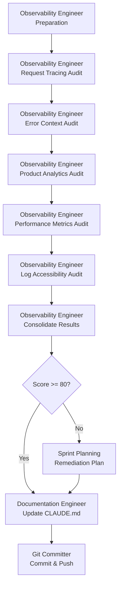

# Workflow: Logging Audit

**Workflow ID:** Logging Audit
**Purpose:** Conduct comprehensive logging audit to ensure production readiness
**Duration:** 2-3 days
**Complexity:** Medium

---

## Overview

This workflow orchestrates a comprehensive logging audit across all application services to ensure production-grade observability. The Observability Engineer conducts a 100-point audit covering request tracing, error context, product analytics, performance metrics, and log accessibility. This is a **mandatory quality gate** - all applications must score ≥80/100 before production deployment.

**Use Cases:**
- Pre-production logging validation
- Production readiness certification
- Compliance audit (GDPR, SOC2, etc.)
- Post-incident logging improvement
- Quarterly logging health checks

**Prerequisites:**
- {{ config.web_framework.frontend or 'Frontend' }} application running- Frontend application running
- {{ config.web_framework.backend or 'Backend' }} service running- Backend API service running
- {{ config.logging.platform or 'Logging platform' }} access configured- Logging platform access configured
- Test accounts with appropriate permissions
- Application endpoints documented

---

## Workflow Steps

### Step 1: Preparation & Setup (Day 1, Morning)
**Agent:** Observability Engineer
**Duration:** 0.5 days
**Input:** Application endpoints, architecture docs
**Output:** Audit preparation checklist

**Activities:**
- Identify all services to audit ({{ config.web_framework.frontend or 'frontend' }}, {{ config.web_framework.backend or 'backend API' }}frontend, backend API)
- Verify access to {{ config.logging.platform or 'logging platform' }}logging platform
- Document test scenarios (normal requests, errors, edge cases)
- Set up test accounts and API keys
- Review existing logging documentation

**Deliverables:**
- Services inventory (all components to audit)
- Test scenario list (10-15 scenarios covering happy path, errors, edge cases)
- Logging platform access verified
- Audit scorecard template (100-point scale)

**Handoff:** Pass test scenarios to Observability Engineer (execution phase)

---

### Step 2: Audit Category 1 - Request Tracing (Day 1, Afternoon)
**Agent:** Observability Engineer
**Duration:** 0.5 days
**Input:** Test scenarios
**Output:** Request tracing audit report
**Score Weight:** 25/100 points

**Activities:**

**2.1 Test Correlation ID Propagation**
```bash
# Python/FastAPI example
curl -H "X-Correlation-ID: test-123" {{ config.api_base_url }}http://localhost:8000/api/items
``````bash
# Node.js/Express example
curl -H "X-Correlation-ID: test-123" {{ config.api_base_url }}http://localhost:3000/api/items
``````bash
# Generic example
curl -H "X-Correlation-ID: test-123" http://localhost:8000/api/items
```

**Check:**
- Does response include `X-Correlation-ID: test-123` header?
- Do {{ config.logging.platform }}logging platform logs show `correlation_id: test-123`?
- Is correlation ID propagated across service boundaries?

**2.2 Test Auto-Generated Correlation IDs**
```bash
curl {{ config.api_base_url }}http://localhost:8000/api/items
```

**Check:**
- Does response include auto-generated `X-Correlation-ID`?
- Is it a valid UUID/unique identifier?

**2.3 Test User Context Propagation**
```bash
curl -H "Authorization: Bearer <token>" {{ config.api_base_url }}http://localhost:8000/api/items
```

**Check:**
- Do logs include `user_id` or `username`?
- Is user context propagated to downstream services?

**Scoring (25 points):**
- ✅ Correlation ID propagation: 10 points
- ✅ Auto-generated correlation IDs: 5 points
- ✅ User context in logs: 5 points
- ✅ Cross-service propagation: 5 points

**Deliverables:**
- Request tracing test results
- Screenshot evidence from {{ config.logging.platform }}logging platform
- Score: __/25

**Handoff:** Pass results to Observability Engineer (Error Context audit)

---

### Step 3: Audit Category 2 - Error Context (Day 2, Morning)
**Agent:** Observability Engineer
**Duration:** 0.5 days
**Input:** Request tracing results
**Output:** Error context audit report
**Score Weight:** 30/100 points

**Activities:**

**3.1 Test 404 Error Logging**
```bash
curl {{ config.api_base_url }}http://localhost:8000/api/nonexistent
```

**Check:**
```
# CloudWatch Logs Insights query
fields @timestamp, level, correlation_id, message, request_path, status_code
| filter status_code = 404
| sort @timestamp desc
| limit 20
``````
# Elasticsearch query
GET /logs-*/_search
{
  "query": {
    "bool": {
      "must": [
        {"term": {"status_code": 404}}
      ]
    }
  },
  "sort": [{"@timestamp": "desc"}]
}
``````
# Generic log query
Search for: status_code:404
Sort by: timestamp desc
Limit: 20
```

- Does log include correlation_id?
- Does log include request_path?
- Does log include status_code: 404?
- Does log include user_id (if authenticated)?

**3.2 Test 500 Error Logging**
```bash
curl -X POST {{ config.api_base_url }}http://localhost:8000/api/items -d '{"invalid": "data"}'
```

**Check:**
```
fields @timestamp, level, correlation_id, error_type, error_message, stack_trace
| filter level = "ERROR"
| sort @timestamp desc
| limit 20
``````
Search for: level:ERROR
Sort by: timestamp desc
Limit: 20
```

- Does log include full stack trace?
- Does log include error_type (exception class)?
- Does log include error_message?
- Does log include input data (sanitized)?

**3.3 Test Validation Error Logging**
```bash
curl -X POST {{ config.api_base_url }}http://localhost:8000/api/items -d '{}'
```

**Check:**
- Does log include validation errors?
- Does log include field names that failed validation?
- Does log distinguish validation errors from system errors?

**Scoring (30 points):**
- ✅ 404 errors logged with context: 5 points
- ✅ 500 errors with full stack traces: 10 points
- ✅ Validation errors with field details: 5 points
- ✅ Error categorization (validation vs system): 5 points
- ✅ Sanitized input data in error logs: 5 points

**Deliverables:**
- Error logging test results
- Sample error logs from {{ config.logging.platform }}logging platform
- Score: __/30

**Handoff:** Pass results to Observability Engineer (Product Analytics audit)

---

### Step 4: Audit Category 3 - Product Analytics (Day 2, Afternoon)
**Agent:** Observability Engineer
**Duration:** 0.5 days
**Input:** Error context results
**Output:** Product analytics audit report
**Score Weight:** 20/100 points

**Activities:**

**4.1 Test Business Event Logging**
```bash
# Test key user actions
curl -X POST {{ config.api_base_url }}http://localhost:8000/api/items -H "Authorization: Bearer <token>" -d '{"name": "Test Item"}'
```

**Check:**
```
fields @timestamp, event_type, user_id, correlation_id, metadata
| filter event_type = "item_created"
| sort @timestamp desc
| limit 20
``````
Search for: event_type:item_created
Sort by: timestamp desc
Limit: 20
```

- Are key business events logged (create, update, delete)?
- Do logs include event_type field?
- Do logs include business metadata?
- Are events queryable for analytics?

**4.2 Test User Journey Logging**
```bash
# Simulate multi-step user journey
curl {{ config.api_base_url }}http://localhost:8000/api/items  # Browse
curl {{ config.api_base_url }}http://localhost:8000/api/items/123  # View details
curl -X POST {{ config.api_base_url }}http://localhost:8000/api/items  # Create
```

**Check:**
- Can you trace a user's journey using correlation_id?
- Are page views/API calls logged?
- Can you identify conversion funnels from logs?

**4.3 Test Performance Event Logging**
```bash
curl {{ config.api_base_url }}http://localhost:8000/api/items?limit=1000
```

**Check:**
```
fields @timestamp, correlation_id, duration_ms, endpoint
| filter duration_ms > 1000
| sort duration_ms desc
| limit 20
``````
Search for: duration_ms > 1000
Sort by: duration_ms desc
Limit: 20
```

- Are response times logged?
- Are slow requests identifiable?
- Are performance metrics queryable?

**Scoring (20 points):**
- ✅ Business events logged: 8 points
- ✅ User journey traceable: 6 points
- ✅ Performance metrics logged: 6 points

**Deliverables:**
- Product analytics test results
- Sample business event logs
- Score: __/20

**Handoff:** Pass results to Observability Engineer (Performance Metrics audit)

---

### Step 5: Audit Category 4 - Performance Metrics (Day 3, Morning)
**Agent:** Observability Engineer
**Duration:** 0.5 days
**Input:** Product analytics results
**Output:** Performance metrics audit report
**Score Weight:** 15/100 points

**Activities:**

**5.1 Test Response Time Logging**
```bash
# Make 10 requests to various endpoints
curl {{ config.api_base_url }}{{ endpoint }}
curl http://localhost:8000/api/items
curl http://localhost:8000/api/items/123
curl http://localhost:8000/api/health
```

**Check:**
```
fields @timestamp, endpoint, method, status_code, duration_ms
| stats avg(duration_ms), max(duration_ms), count() by endpoint
``````
Query: Calculate avg(duration_ms), max(duration_ms) grouped by endpoint
```

- Is response time logged for every request?
- Can you calculate p50, p95, p99 latencies?
- Are slow queries identifiable?

**5.2 Test Database Query Logging**

**Check:**
```
# PostgreSQL slow query log
SELECT query, calls, mean_exec_time, max_exec_time
FROM pg_stat_statements
ORDER BY mean_exec_time DESC
LIMIT 10;
``````
# MySQL slow query log
SELECT * FROM mysql.slow_log
ORDER BY query_time DESC
LIMIT 10;
``````
# Check database slow query logs
``````
# Check database slow query logs
```

- Are slow database queries logged?
- Can you identify N+1 query problems?
- Are query execution times tracked?

**5.3 Test Resource Utilization Logging**

**Check:**
- Is memory usage logged?
- Is CPU usage logged?
- Are resource spikes identifiable?

**Scoring (15 points):**
- ✅ Response time logging: 6 points
- ✅ Database query performance: 5 points
- ✅ Resource utilization: 4 points

**Deliverables:**
- Performance metrics test results
- Latency distribution analysis
- Score: __/15

**Handoff:** Pass results to Observability Engineer (Log Accessibility audit)

---

### Step 6: Audit Category 5 - Log Accessibility (Day 3, Afternoon)
**Agent:** Observability Engineer
**Duration:** 0.5 days
**Input:** Performance metrics results
**Output:** Log accessibility audit report
**Score Weight:** 10/100 points

**Activities:**

**6.1 Test Log Searchability**

**Check:**
```
# Test various CloudWatch queries
fields @timestamp, correlation_id, level, message
| filter correlation_id = "test-123"

fields @timestamp, user_id, event_type
| filter user_id = "user-456"

fields @timestamp, endpoint, duration_ms
| filter endpoint = "/api/items" and duration_ms > 1000
``````
# Test Elasticsearch queries
GET /logs-*/_search
{
  "query": {
    "bool": {
      "must": [
        {"term": {"correlation_id": "test-123"}}
      ]
    }
  }
}
``````
# Test log platform queries
- Search by correlation_id
- Search by user_id
- Search by endpoint
- Search by duration
```

- Are logs structured (JSON)?
- Are key fields indexed and searchable?
- Can you search by correlation_id, user_id, endpoint?

**6.2 Test Log Retention**

**Check:**
- What is the log retention policy? (30 days minimum recommended)
- Are logs archived for compliance?
- Can you access historical logs?

**6.3 Test Log Access Controls**

**Check:**
- Are logs access-controlled (RBAC)?
- Can developers access logs?
- Are sensitive logs (PII) restricted?

**Scoring (10 points):**
- ✅ Structured, searchable logs: 5 points
- ✅ Adequate retention (≥30 days): 3 points
- ✅ Access controls in place: 2 points

**Deliverables:**
- Log accessibility test results
- Sample queries demonstrating searchability
- Score: __/10

**Handoff:** Pass results to Observability Engineer (consolidation phase)

---

### Step 7: Consolidate Audit Results (Day 3, End of Day)
**Agent:** Observability Engineer
**Duration:** 0.25 days
**Input:** All 5 audit category results
**Output:** Consolidated audit report

**Activities:**
- Compile scores from all 5 categories
- Calculate total score (out of 100)
- Identify gaps (items that scored 0)
- Categorize issues by severity (critical, high, medium, low)
- Generate recommendations for improvements

**Deliverables:**
- **Logging Audit Report** (`docs/audits/logging-audit-YYYY-MM-DD.md`)
- Total score: __/100
- Category breakdown (Request Tracing, Error Context, Product Analytics, Performance Metrics, Log Accessibility)
- Gap analysis (what's missing)
- Severity-ranked issues

**Pass/Fail Criteria:**
- **PASS:** Score ≥ 80/100
- **FAIL:** Score < 80/100

**Handoff:** Pass audit report to Sprint Planning Agent (if fail, create remediation tasks)

---

### Step 8: Create Remediation Plan (If Fail) [CONDITIONAL]
**Agent:** Sprint Planning Agent
**Duration:** 0.5 days
**Input:** Logging audit report (if score < 80/100)
**Output:** Remediation task list
**Trigger:** Only if audit score < 80/100

**Activities:**
- Review gaps and issues from audit report
- Prioritize issues by severity (critical → high → medium → low)
- Create remediation tasks for each gap
- Estimate effort for each task
- Sequence tasks (dependencies)
- Add tasks to current sprint or next sprint

**Deliverables:**
- Remediation task list (ranked by priority)
- Effort estimates
- Sprint assignment (current vs next sprint)

**Handoff:** Pass remediation tasks to appropriate development agents

---

### Step 9: Update CLAUDE.md & Commit (Day 3, End of Day)
**Agent:** Documentation Engineer + Git Committer
**Duration:** 0.25 days
**Input:** Audit report
**Output:** Updated documentation + git commit

**Activities:**

**Documentation Engineer:**
- Update CLAUDE.md with audit results
- Document logging score in quality metrics section
- Update production readiness status
- Document any logging patterns established

**Git Committer:**
- Stage audit report
- Stage CLAUDE.md updates
- Create commit: "Add logging audit report (score: X/100)"
- Push to remote

**Deliverables:**
- Updated CLAUDE.md
- Git commit with audit artifacts
- Audit report in version control

**Completion:** Logging audit workflow complete

---

## Workflow Diagram



---

## Duration Estimates

| Phase | Agent | Duration | Cumulative |
|-------|-------|----------|------------|
| Preparation | Observability Engineer | 0.5 days | Day 0.5 |
| Request Tracing Audit | Observability Engineer | 0.5 days | Day 1 |
| Error Context Audit | Observability Engineer | 0.5 days | Day 1.5 |
| Product Analytics Audit | Observability Engineer | 0.5 days | Day 2 |
| Performance Metrics Audit | Observability Engineer | 0.5 days | Day 2.5 |
| Log Accessibility Audit | Observability Engineer | 0.5 days | Day 3 |
| Consolidate Results | Observability Engineer | 0.25 days | Day 3.25 |
| Remediation Plan (if fail) | Sprint Planning | 0.5 days | Day 3.75 |
| Update CLAUDE.md & Commit | Documentation + Git | 0.25 days | Day 4 |
| **Total** | | **3-4 days** | **~1 week** |

**If Pass (≥80/100):** 3 days
**If Fail (<80/100):** 3.5-4 days (includes remediation planning)

---

## Scoring System

### Total Score: 100 Points

| Category | Weight | Subcategories |
|----------|--------|---------------|
| **Request Tracing** | 25 pts | Correlation ID (10), Auto-generation (5), User context (5), Cross-service (5) |
| **Error Context** | 30 pts | 404 logging (5), 500 errors (10), Validation errors (5), Categorization (5), Sanitized input (5) |
| **Product Analytics** | 20 pts | Business events (8), User journeys (6), Performance events (6) |
| **Performance Metrics** | 15 pts | Response times (6), Database queries (5), Resource utilization (4) |
| **Log Accessibility** | 10 pts | Searchability (5), Retention (3), Access controls (2) |

### Pass/Fail Thresholds

- **Production Ready (Pass):** ≥ 80/100
- **Needs Improvement (Fail):** < 80/100
- **Critical Failure:** < 50/100 (blocks all production deployments)

### Severity Classification

**Critical (Blocks Production):**
- No correlation ID propagation (0/10 on Request Tracing)
- No stack traces on 500 errors (0/10 on Error Context)
- No structured logs (0/5 on Log Accessibility)

**High (Strongly Recommended):**
- Missing user context in logs
- Missing business event logging
- No performance metrics

**Medium (Should Fix):**
- Incomplete validation error logging
- Limited searchability
- Short retention periods (<30 days)

**Low (Nice to Have):**
- Missing resource utilization metrics
- Limited access controls

---

## Sample Audit Report Template

```markdown
# Logging Audit Report

**Date:** YYYY-MM-DD
**Auditor:** [Name]
**Application:** [App Name]
**Services Audited:** {{ config.web_framework.frontend or 'Frontend' }}, {{ config.web_framework.backend or 'Backend API' }}Frontend, Backend API

---

## Executive Summary

**Total Score: X/100**
**Status:** ✅ PASS (≥80) | ❌ FAIL (<80)

### Category Scores

| Category | Score | Status |
|----------|-------|--------|
| Request Tracing | X/25 | ✅/❌ |
| Error Context | X/30 | ✅/❌ |
| Product Analytics | X/20 | ✅/❌ |
| Performance Metrics | X/15 | ✅/❌ |
| Log Accessibility | X/10 | ✅/❌ |

---

## Detailed Findings

### Request Tracing (X/25)

✅ **Passed:**
- Correlation ID propagation working
- Auto-generation functional

❌ **Failed:**
- User context not propagated to downstream services

**Evidence:**
[Screenshots from {{ config.logging.platform }}logging platform]

---

### Error Context (X/30)

[Similar format...]

---

## Recommendations

### Critical (Fix Immediately)
1. [Issue description]
   - **Impact:** [Business impact]
   - **Effort:** [X days]
   - **Owner:** [Team/person]

### High Priority (Fix This Sprint)
[...]

### Medium Priority (Fix Next Sprint)
[...]

---

## Appendix: Test Evidence

[Include screenshots, log samples, query results]
```

---

## Success Criteria

### Must Have
- [ ] All 5 audit categories completed
- [ ] Total score calculated (out of 100)
- [ ] Audit report created
- [ ] CLAUDE.md updated with audit results

### Should Have
- [ ] Score ≥ 80/100 (production ready)
- [ ] Remediation plan created (if fail)
- [ ] Evidence screenshots included
- [ ] Git commit with audit artifacts

### Nice to Have
- [ ] Automated logging tests created
- [ ] Logging dashboard created
- [ ] Quarterly audit schedule established

---

## Integration with Other Workflows

**Triggers other workflows:**
- Sprint Planning - If remediation needed (score < 80/100)
- Documentation Diagrams - If logging architecture diagrams needed

**Invoked by:**
- Sprint Planning - As mandatory quality gate
- Feature Development - Before production deployment
- Incident Response - After major incidents to improve logging

**Blocks:**
- Production deployment if score < 80/100

---

## Related Documentation

**Agent Instructions:**
- `agents/quality/observability-engineer.md`
- `agents/planning/sprint-planning.md`

**Templates:**
- Logging audit report template
- Remediation plan template

**Standards:**
- Logging standards document
- Production readiness checklist

---

**Created:** 2025-11-04
**Status:** ✅ Generic
**Version:** 1.0
**Framework:** Vibey Agent Framework
