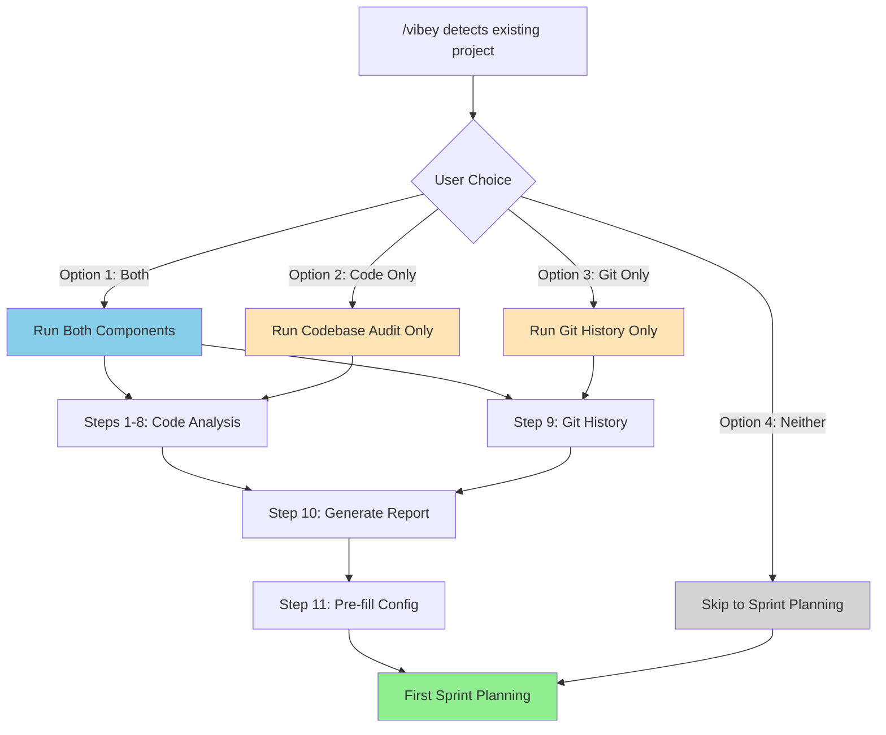
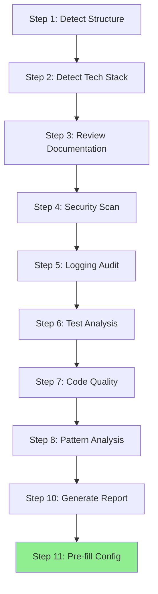
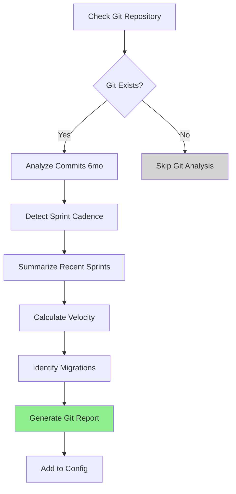

# Workflow: Codebase Audit & Discovery

**Workflow ID:** Codebase Audit & Discovery
**Purpose:** Comprehensive analysis of existing codebase before first sprint planning
**Duration:** 60-105 minutes (code audit only) OR 10-20 minutes (git history only) OR 70-125 minutes (both)
**Complexity:** Medium
**Trigger:** Optional when `/vibey` detects existing code or git repository
**Note:** This workflow has two independent components that can be run separately or together

---

## Overview

This workflow has **two independent components** that can be run separately or together:

### Component 1: Codebase Audit (Steps 1-8, 10-11)
**Duration:** 60-105 minutes
**Purpose:** Analyze code structure, tech stack, security, testing, and quality

Discovers and documents:
- Project structure and architecture
- Technology stack and dependencies
- Existing documentation and conventions
- Code quality metrics (test coverage, security, logging)
- Gaps and improvement opportunities

**Prerequisites:**
- Existing codebase with source files
- Project is accessible (can read files)

**Output:**
- Comprehensive audit report with health scores (`docs/codebase-audit-report.md`)
- Pre-filled .claude/project-config.yaml with detected values

### Component 2: Git History Analysis (Step 9)
**Duration:** 10-20 minutes
**Purpose:** Analyze development history to understand recent work and velocity

Discovers and documents:
- Sprint cadence and release patterns
- Recent sprints (last 2-3 sprints worth of work)
- Development velocity and team activity
- Recent technology migrations
- Breaking changes timeline

**Prerequisites:**
- Git repository with commit history

**Output:**
- Git history section in audit report (if combined)
- OR standalone git history report (if run alone)
- Pre-filled sprint cadence and velocity in .claude/project-config.yaml

### Combination Options

**User can choose:**

1. **Both components** (70-125 min) - Maximum context, comprehensive audit + git history
2. **Codebase audit only** (60-105 min) - Code analysis without git history
3. **Git history only** (10-20 min) - Historical context without code analysis
4. **Neither** (0 min) - Skip analysis, answer questions manually during sprint planning

**Use Cases:**
- First-time Vibey initialization in an existing project
- Mature project adding Vibey framework
- Project with recent development history
- Teams wanting to reduce discovery burden in sprint planning

---

## Why This Workflow Matters

### The Time vs. Quality Tradeoff

This workflow offers **optional** analysis to reduce discovery burden at the expense of time:

**Option 1: Skip Analysis (0 minutes)**
- ✅ Fastest to start sprint planning
- ❌ Answer 20+ basic questions manually
- ❌ Claude starts with zero context
- ❌ No automated gap detection
- **Best for:** Time-constrained teams, very small projects, teams who prefer manual control

**Option 2: Git History Only (10-20 minutes)**
- ✅ Quick historical context
- ✅ Understand recent work and velocity
- ✅ Detect sprint cadence automatically
- ❌ Still answer tech stack questions manually
- ❌ No code quality analysis
- **Best for:** Teams who want sprint context but limited time

**Option 3: Codebase Audit Only (60-105 minutes)**
- ✅ Skip 20+ tech stack questions
- ✅ Comprehensive code quality analysis
- ✅ Security and gap detection
- ❌ No historical context about recent work
- ❌ No velocity baseline for planning
- **Best for:** Teams prioritizing code quality over historical context

**Option 4: Both Analyses (70-125 minutes)**
- ✅ Maximum context and quality
- ✅ Strategic sprint planning (not administrative)
- ✅ Code quality + historical context
- ✅ Velocity-based planning
- ❌ Longest time investment upfront
- **Best for:** Mature projects, teams optimizing for quality sprint planning

### Example Comparison

**Without Any Analysis (0 min):**
```
Claude: "What's your project called?"
User: "my-api"

Claude: "What type of project is it?"
User: "It's an API"

Claude: "What backend framework?"
User: "FastAPI"

... (20+ more questions)

Claude: "What are your goals for the first sprint?"
User: "We just finished auth and payments, now we want billing"
Claude: "Tell me about the auth and payments work..."
User: [Explains last 3 sprints manually]
```

**With Codebase Audit Only (60-105 min):**
```
Claude: "I analyzed your FastAPI project:
- 127 tests with 78% coverage ✓
- PostgreSQL + SQLAlchemy ✓
- Security score: 72/100 ⚠️ (needs rate limiting)

What are your goals for the first sprint?"

User: "We just finished auth and payments, now billing"
Claude: "Tell me about the recent work..."
User: [Still explains history manually]
```

**With Git History Only (10-20 min):**
```
Claude: "I analyzed your git history:
- Bi-weekly sprint cadence
- Sprint 8: Auth overhaul (OAuth2, 2FA)
- Sprint 7: Payment integration (Stripe)
- 45 commits/week average

What's your tech stack?"
User: "FastAPI and PostgreSQL"
... (Still answers tech questions)
```

**With Both Analyses (70-125 min):**
```
Claude: "I analyzed your project:

Code: FastAPI + PostgreSQL, 78% test coverage, security needs work
History: Bi-weekly sprints, just finished auth (Sprint 8) and payments (Sprint 7)

You're averaging 45 commits/week. Based on this velocity and your security gaps,
should we focus on security improvements or start the billing feature?"

User: "Security first, then billing"
Claude: "Perfect. Based on your velocity, here's a realistic sprint plan..."
```

**Result:** Investment of time upfront = better quality sprint planning with strategic focus.

---

## Workflow Steps

### Step 1: Detect Project Type & Structure (5-10 minutes)
**Agent:** Researcher
**Input:** Project directory structure
**Output:** Project type, structure analysis

**Activities:**
- Scan directory structure
- Identify project type (web-app, API, ML, data-platform, infrastructure)
- Map directory layout to known patterns
- Identify monorepo vs single-project structure
- Detect frontend/backend separation

**Detection Patterns:**

**Web Application:**
```bash
# Frontend indicators
ls src/components/ src/pages/ src/views/ 2>/dev/null
ls public/ static/ assets/ 2>/dev/null
grep -r "import React" "import Vue" "import Angular" src/ 2>/dev/null

# Backend indicators
ls src/api/ src/routes/ src/controllers/ 2>/dev/null
ls server/ backend/ api/ 2>/dev/null
```

**API Service:**
```bash
ls src/routes/ src/endpoints/ src/api/ 2>/dev/null
ls openapi.yaml swagger.json api-spec.yaml 2>/dev/null
grep -r "FastAPI\|Express\|Flask\|Spring" src/ 2>/dev/null
```

**ML Project:**
```bash
ls notebooks/ models/ experiments/ 2>/dev/null
ls MLproject mlflow.yaml 2>/dev/null
grep -r "tensorflow\|pytorch\|scikit-learn" requirements.txt pyproject.toml 2>/dev/null
```

**Deliverables:**
- Project type classification
- Directory structure map
- Architecture pattern identification (MVC, layered, microservices, etc.)

**Handoff:** Pass structure analysis to Researcher (tech stack detection)

---

### Step 2: Detect Technology Stack (10-15 minutes)
**Agent:** Researcher
**Input:** Project files, dependency files
**Output:** Complete technology stack inventory

**Activities:**

**Backend Detection:**
```bash
# Python
cat requirements.txt pyproject.toml setup.py 2>/dev/null
grep -E "flask|fastapi|django|tornado" requirements.txt

# Node.js
cat package.json 2>/dev/null
grep -E "express|nestjs|koa|hapi" package.json

# Java
cat pom.xml build.gradle 2>/dev/null
grep -E "spring-boot|quarkus|micronaut" pom.xml

# Go
cat go.mod 2>/dev/null
grep -E "gin|echo|fiber" go.mod
```

**Frontend Detection:**
```bash
# JavaScript/TypeScript
cat package.json 2>/dev/null
grep -E "react|vue|angular|svelte|solid" package.json

# Check for frameworks
grep -E "next|nuxt|gatsby|remix" package.json
```

**Database Detection:**
```bash
# PostgreSQL
grep -E "psycopg2|pg|postgres" requirements.txt package.json
ls alembic/ migrations/ 2>/dev/null

# MongoDB
grep -E "pymongo|mongoose|mongodb" requirements.txt package.json

# MySQL
grep -E "mysql|pymysql|mysql2" requirements.txt package.json

# Redis
grep -E "redis|ioredis" requirements.txt package.json
```

**Infrastructure Detection:**
```bash
# Docker
ls Dockerfile docker-compose.yml .dockerignore 2>/dev/null

# Kubernetes
ls k8s/ kubernetes/ *.yaml 2>/dev/null | grep -E "deployment|service|ingress"

# IaC
ls terraform/ *.tf main.tf 2>/dev/null
ls pulumi/ Pulumi.yaml 2>/dev/null
ls cloudformation/ *.yaml *.json 2>/dev/null | grep -i template
```

**Deliverables:**
- Complete dependency inventory
- Framework versions
- Database and cache systems
- Infrastructure tools
- Development tools

**Handoff:** Pass tech stack to Researcher (documentation review)

---

### Step 3: Review Existing Documentation (5-10 minutes)
**Agent:** Researcher
**Input:** Project documentation files
**Output:** Documentation inventory and quality assessment

**Activities:**

**Find Documentation:**
```bash
# Project documentation
ls README.md CONTRIBUTING.md CHANGELOG.md CODE_OF_CONDUCT.md 2>/dev/null

# API documentation
ls docs/api/ openapi.yaml swagger.json api-docs/ 2>/dev/null

# Architecture documentation
ls docs/architecture/ ARCHITECTURE.md docs/design/ 2>/dev/null
find docs/ -name "*.md" -o -name "*.rst" 2>/dev/null

# Code documentation
grep -r "\"\"\"" "'''" src/ | head -20  # Python docstrings
grep -r "\/\*\*" "\/\/" src/ | head -20  # JSDoc/comments
```

**Assess Documentation Quality:**
- README completeness (setup instructions, usage examples, contribution guide)
- API documentation (endpoints documented, request/response examples)
- Architecture documentation (diagrams, design decisions, patterns)
- Code documentation (docstrings, comments, inline documentation)

**Deliverables:**
- Documentation inventory (what exists)
- Documentation gaps (what's missing)
- Documentation quality score (0-100)
- Recommendations for improvement

**Handoff:** Pass documentation assessment to Security Reviewer (security scan)

---

### Step 4: Security Scan (10-15 minutes)
**Agent:** Security Reviewer
**Input:** Source code, dependencies
**Output:** Security assessment and vulnerability report

**Activities:**

**Secrets Detection:**
```bash
# Check for hardcoded secrets
grep -rE "password\s*=|api_key\s*=|secret\s*=|token\s*=" src/ --include="*.py" --include="*.js" --include="*.ts"

# Check .env files (shouldn't be committed)
ls .env .env.local .env.production 2>/dev/null && echo "⚠️  .env files committed to repo"

# Check for API keys in code
grep -rE "[A-Za-z0-9]{20,}" src/ | grep -iE "key|token|secret" | head -10
```

**Dependency Vulnerabilities:**
```bash
# Python
pip install safety 2>/dev/null
safety check --json 2>/dev/null || echo "Run: pip install safety && safety check"

# Node.js
npm audit --json 2>/dev/null || echo "Run: npm audit"

# Check for outdated dependencies
pip list --outdated 2>/dev/null
npm outdated 2>/dev/null
```

**Security Patterns:**
```bash
# SQL injection risks
grep -rE "execute\(.*%s|execute\(.*\+|execute\(.*f\"" src/ --include="*.py"

# XSS risks
grep -rE "innerHTML|dangerouslySetInnerHTML" src/ --include="*.js" --include="*.jsx" --include="*.ts" --include="*.tsx"

# Authentication/Authorization
grep -rE "authenticate|authorize|login|jwt" src/ --include="*.py" --include="*.js" --include="*.ts"
```

**Deliverables:**
- Security score (0-100)
- Hardcoded secrets found
- Dependency vulnerabilities
- Security pattern issues
- Critical/High/Medium/Low severity breakdown

**Handoff:** Pass security assessment to Observability Engineer (logging audit)

---

### Step 5: Logging & Observability Audit (5-10 minutes)
**Agent:** Observability Engineer
**Input:** Source code, configuration
**Output:** Logging assessment

**Activities:**

**Logging Detection:**
```bash
# Python
grep -rE "logging\.|logger\.|log\." src/ --include="*.py" | wc -l

# Node.js
grep -rE "console\.|winston|pino|bunyan" src/ --include="*.js" --include="*.ts" | wc -l

# Check for structured logging
grep -rE "correlation_id|request_id|trace_id" src/
```

**Monitoring Detection:**
```bash
# APM tools
grep -rE "newrelic|datadog|sentry|rollbar" requirements.txt package.json

# Metrics
grep -rE "prometheus|statsd|metrics" src/

# Health checks
grep -rE "/health|/healthz|/readiness|/liveness" src/
```

**Deliverables:**
- Logging coverage assessment
- Logging patterns (structured vs unstructured)
- Monitoring tools detected
- Observability score (0-100)
- Recommendations for improvement

**Handoff:** Pass logging assessment to Test Engineer (test analysis)

---

### Step 6: Test Coverage Analysis (10-15 minutes)
**Agent:** Test Engineer (via Researcher agent)
**Input:** Test files, test configuration
**Output:** Test coverage report

**Activities:**

**Find Tests:**
```bash
# Python
find . -name "test_*.py" -o -name "*_test.py" 2>/dev/null | wc -l
ls tests/ test/ spec/ 2>/dev/null

# Node.js
find . -name "*.test.js" -o -name "*.test.ts" -o -name "*.spec.js" -o -name "*.spec.ts" 2>/dev/null | wc -l

# Check test framework
grep -E "pytest|unittest|jest|mocha|vitest" requirements.txt package.json pytest.ini jest.config.js
```

**Run Test Discovery:**
```bash
# Python - count tests without running
pytest --collect-only 2>/dev/null | grep "test session starts" -A 100 | grep "<" | wc -l

# Node.js - count tests
npm test -- --listTests 2>/dev/null | wc -l
```

**Check Coverage Configuration:**
```bash
ls .coveragerc pytest.ini setup.cfg | grep -E "coverage"
cat package.json | grep -A 5 "jest.*coverage"
```

**Attempt Coverage Calculation (if safe):**
```bash
# Only if tests are fast and safe to run
# Python
pytest --cov --cov-report=json --no-cov-on-fail -x 2>/dev/null
cat coverage.json 2>/dev/null | grep "percent_covered"

# Node.js
npm test -- --coverage --json 2>/dev/null | grep "coveragePercent"
```

**Deliverables:**
- Test count
- Test coverage percentage (if calculable)
- Test framework detected
- Test organization assessment
- Testing gaps identified

**Handoff:** Pass test analysis to Sprint Planning Agent (synthesis)

---

### Step 7: Code Quality Metrics (5-10 minutes)
**Agent:** Researcher
**Input:** Source code
**Output:** Code quality metrics

**Activities:**

**Calculate Basic Metrics:**
```bash
# Lines of code
find src/ -name "*.py" -o -name "*.js" -o -name "*.ts" 2>/dev/null | xargs wc -l | tail -1

# File count
find src/ -type f \( -name "*.py" -o -name "*.js" -o -name "*.ts" \) 2>/dev/null | wc -l

# Average file size
find src/ -type f \( -name "*.py" -o -name "*.js" -o -name "*.ts" \) -exec wc -l {} \; 2>/dev/null | awk '{sum+=$1; count++} END {print int(sum/count)}'
```

**Check Code Style:**
```bash
# Python
ls .flake8 .pylintrc pyproject.toml | grep -E "flake8|pylint|black|ruff"
grep -E "black|flake8|pylint|ruff" requirements.txt pyproject.toml

# Node.js
ls .eslintrc* .prettierrc* 2>/dev/null
cat package.json | grep -E "eslint|prettier"
```

**Check Type Safety:**
```bash
# Python
grep -E "mypy|pyright|pydantic" requirements.txt pyproject.toml

# TypeScript
cat tsconfig.json 2>/dev/null | grep "strict"
```

**Deliverables:**
- Lines of code
- File count and average size
- Code style tools detected
- Type safety configuration
- Code organization score

**Handoff:** Pass metrics to Sprint Planning Agent (synthesis)

---

### Step 8: Identify Patterns & Conventions (5 minutes)
**Agent:** Architecture Specialist (via Researcher)
**Input:** Code structure, file organization
**Output:** Pattern analysis

**Activities:**

**Detect Architecture Patterns:**
- Layered architecture (routes → controllers → services → repositories)
- MVC pattern (models, views, controllers)
- Clean architecture (domain, application, infrastructure)
- Microservices (multiple services, API gateway)

**Detect Code Conventions:**
```bash
# Naming conventions
ls src/ | head -20  # Check file naming (kebab-case, snake_case, PascalCase)

# Import organization
head -20 src/main.py src/index.ts 2>/dev/null  # Check import patterns

# Error handling patterns
grep -rE "try:|catch|except:" src/ | head -10
```

**Deliverables:**
- Architecture pattern identified
- Naming conventions documented
- Code organization patterns
- Consistency score

**Handoff:** Pass patterns to Sprint Planning Agent (git history analysis)

---

### Step 9: Git History Analysis (OPTIONAL - Can Run Independently)
**Agent:** Researcher
**Input:** Git repository history
**Output:** Development history analysis and sprint backfill context
**Duration:** 10-20 minutes
**Independence:** Can be run without Steps 1-8 (codebase audit)

**When to Run This Step:**

This step is **completely optional and independent**:

1. **Run with codebase audit (Option 1: Both):** If user chose "Both analyses" in `/vibey`
2. **Run standalone (Option 3: Git history only):** If user chose "Git history only" in `/vibey`
3. **Skip entirely (Options 2 & 4):** If user chose "Codebase audit only" or "Neither"

**Prerequisites:**
- Project is a git repository (check below)
- User has selected to run git history analysis

**Check Git Repository:**
```bash
# Verify git repository exists
git rev-parse --is-inside-work-tree 2>/dev/null
```

**If NOT a git repository:**
- Cannot run git history analysis
- If user selected "Git history only" → Inform user git repo not found, offer codebase audit instead
- If user selected "Both" → Run codebase audit only (Steps 1-8, 10-11)
- Proceed without git history section

**If git repository EXISTS and user selected git history:**
- Continue with git analysis below

**Analyze Commit History:**
```bash
# Get last 6 months of commits
git log --since="6 months ago" --pretty=format:"%h|%an|%ad|%s" --date=short > /tmp/commits.txt

# Count commits
git log --since="6 months ago" --oneline | wc -l

# Commits per month
git log --since="6 months ago" --pretty=format:"%ad" --date=format:"%Y-%m" | sort | uniq -c

# Commits per author
git shortlog -s -n --since="6 months ago"

# Most active files
git log --since="6 months ago" --pretty=format: --name-only | sort | uniq -c | sort -rn | head -20
```

**Detect Sprint/Release Patterns:**
```bash
# Check for tags (releases)
git tag -l --sort=-version:refname | head -10

# Check for release branches
git branch -r | grep -E "release|v[0-9]+\.[0-9]+"

# Analyze tag dates to detect sprint cadence
git for-each-ref --sort=creatordate --format '%(refname:short)|%(creatordate:short)' refs/tags | tail -10

# Check for sprint branch patterns
git branch -r | grep -E "sprint-[0-9]+|iteration-[0-9]+"
```

**Analyze Commit Messages for Patterns:**
```bash
# Common feature keywords
git log --since="6 months ago" --oneline | grep -iE "feat|feature|add|implement" | wc -l

# Bug fixes
git log --since="6 months ago" --oneline | grep -iE "fix|bug|hotfix" | wc -l

# Refactoring
git log --since="6 months ago" --oneline | grep -iE "refactor|cleanup|improve" | wc -l

# Documentation
git log --since="6 months ago" --oneline | grep -iE "docs|documentation|readme" | wc -l

# Testing
git log --since="6 months ago" --oneline | grep -iE "test|spec|coverage" | wc -l

# Security
git log --since="6 months ago" --oneline | grep -iE "security|vuln|cve" | wc -l
```

**Identify Recent Major Work:**
```bash
# Get recent merge commits (feature completion)
git log --since="6 months ago" --merges --oneline | head -20

# Get recent sprint summaries (if conventional commits used)
git log --since="6 months ago" --grep="^sprint" -i --oneline

# Recent breaking changes
git log --since="6 months ago" --grep="BREAKING CHANGE" --oneline
```

**Analyze Development Velocity:**
```bash
# Weekly commit activity
git log --since="12 weeks ago" --pretty=format:"%ad" --date=format:"%Y-week-%U" | sort | uniq -c

# Average commits per week
WEEKS=$(git log --since="12 weeks ago" --pretty=format:"%ad" --date=format:"%Y-week-%U" | sort -u | wc -l)
COMMITS=$(git log --since="12 weeks ago" --oneline | wc -l)
echo "Average: $((COMMITS / WEEKS)) commits/week"

# Lines changed per month
git log --since="6 months ago" --pretty=format:"%ad" --date=format:"%Y-%m" --numstat | \
  awk '{adds+=$1; dels+=$2} END {print "~"int((adds+dels)/6)" lines/month"}'
```

**Detect Technology Migrations:**
```bash
# Recent dependency changes
git log --since="6 months ago" --oneline -- requirements.txt package.json go.mod Cargo.toml | head -10

# Database migrations
git log --since="6 months ago" --oneline -- alembic/ migrations/ db/ | head -10

# Infrastructure changes
git log --since="6 months ago" --oneline -- Dockerfile docker-compose.yml terraform/ k8s/ | head -10
```

**Extract Recent Feature Context:**
```bash
# Read recent detailed commits (last 20 significant merges)
git log --since="6 months ago" --merges --pretty=format:"%h|%ad|%s%n%b" --date=short | head -100 > /tmp/recent-features.txt

# Analyze recent PR/merge messages for feature descriptions
git log --since="3 months ago" --merges --pretty=format:"%s%n%b" | grep -E "^(feat|feature|implement|add)" -A 5 | head -50
```

**Deliverables:**
- **Development timeline** (last 6 months of activity)
- **Sprint cadence detection** (weekly, bi-weekly, monthly based on tags/branches)
- **Recent feature summary** (last 2-3 sprints worth of completed work)
- **Development velocity metrics** (commits/week, lines changed/month)
- **Team activity patterns** (active contributors, commit distribution)
- **Recent focus areas** (features vs bugs vs refactoring breakdown)
- **Technology evolution** (migrations, dependency updates, infrastructure changes)
- **Breaking changes history** (major changes, migrations)
- **Legacy context for roadmap** (what was built, what's in progress, what's next)

**Output Format:**
```markdown
## Git History Analysis (Last 6 Months)

### Sprint Cadence
- **Detected Cadence:** Bi-weekly sprints (based on tag pattern v1.X.0 every 2 weeks)
- **Recent Releases:**
  - v1.8.0 (2024-10-15) - "User authentication overhaul"
  - v1.7.0 (2024-10-01) - "Payment gateway integration"
  - v1.6.0 (2024-09-15) - "Admin dashboard v2"

### Recent Sprint Summary (Last 3 Sprints)

**Sprint 8 (Oct 1-15, 2024):** User Authentication Overhaul
- Implemented OAuth2 + JWT authentication
- Added 2FA support
- Migrated from session-based to token-based auth
- 47 commits, 3,200 lines changed

**Sprint 7 (Sep 15-30, 2024):** Payment Gateway Integration
- Integrated Stripe payment processing
- Added subscription management
- Implemented webhook handlers
- 38 commits, 2,800 lines changed

**Sprint 6 (Sep 1-14, 2024):** Admin Dashboard Redesign
- Rebuilt admin UI with React
- Added real-time analytics
- Implemented role-based access control
- 52 commits, 4,100 lines changed

### Development Velocity
- **Average:** 45 commits/week
- **Contributors:** 3 active developers
- **Code churn:** ~3,500 lines/month
- **Commit breakdown:**
  - Features: 65%
  - Bug fixes: 20%
  - Refactoring: 10%
  - Documentation: 5%

### Recent Technology Changes
- **Oct 2024:** Migrated from PostgreSQL 14 → 16
- **Sep 2024:** Upgraded React 17 → 18
- **Aug 2024:** Adopted TypeScript for frontend (migration 80% complete)
- **Jul 2024:** Switched from Docker Compose → Kubernetes

### Most Active Areas (Last 6 Months)
1. `src/api/auth/` - 127 commits (authentication overhaul)
2. `src/frontend/dashboard/` - 98 commits (admin redesign)
3. `src/payments/` - 76 commits (payment integration)
4. `src/api/subscriptions/` - 54 commits (subscription system)

### Identified Patterns
- **Sprint Length:** 2 weeks (consistent)
- **Release Pattern:** End of sprint releases
- **Branch Strategy:** Git Flow (feature branches → develop → main)
- **Commit Conventions:** Partially using Conventional Commits (60% compliance)
- **Breaking Changes:** 3 in last 6 months (authentication, database, deployment)

### Context for Roadmap Planning
Based on recent history, the project is:
- **In active development** (consistent velocity)
- **Feature-focused** (65% of work is new features)
- **Modernizing stack** (React 18, TypeScript, K8s migrations ongoing)
- **Security-conscious** (recent auth overhaul, 2FA addition)
- **Following sprint cadence** (bi-weekly releases)

**Recommended First Sprint Focus:**
1. Complete TypeScript migration (20% remaining)
2. Address technical debt from rapid feature development
3. Improve test coverage (currently 78%, target 85%+)
4. Plan next major feature (based on user's strategic goals)
```

**Benefits of Git History Analysis:**
- **Sprint context backfill** - Understand what was built in last 2-3 sprints without asking
- **Velocity baseline** - Know actual development pace for realistic planning
- **Pattern detection** - Identify sprint length, release cadence, branching strategy
- **Technology trajectory** - Understand recent migrations and modernization efforts
- **Team insights** - Active contributors, code ownership patterns
- **Roadmap continuity** - Plan next sprint based on recent work, not from scratch
- **Realistic planning** - Use actual velocity data, not guesses

**User Benefit:**
Instead of explaining "We've been working on authentication, payment integration, and admin dashboard over the last 3 sprints," Claude discovers this automatically and asks: "I see you recently completed auth, payments, and admin features. Should we focus on completing the TypeScript migration, or start the next major feature?"

**Handoff:** Pass git history analysis to Documentation Engineer (final report synthesis)

---

### Step 10: Generate Audit Report (5-10 minutes)
**Agent:** Documentation Engineer
**Input:** All previous analysis outputs
**Output:** Comprehensive audit report

**Activities:**
- Synthesize all findings into structured report
- Use audit report template
- Calculate overall health scores
- Identify top priorities for improvement
- Generate recommendations for first sprint

**Report Structure:**
1. Executive Summary
2. Project Overview (type, structure, tech stack)
3. Documentation Assessment
4. Security Assessment
5. Testing & Quality
6. Logging & Observability
7. Code Quality Metrics
8. Patterns & Conventions
9. Identified Gaps
10. Recommendations for First Sprint

**Deliverables:**
- **Codebase Audit Report** (`docs/codebase-audit-report.md`)
- Overall health score (0-100)
- Top 5 improvement priorities
- Suggested first sprint focus areas

**Handoff:** Pass audit report to Sprint Planning Agent (configuration pre-fill)

---

### Step 11: Pre-fill Project Configuration (5 minutes)
**Agent:** Sprint Planning Agent
**Input:** Audit report, detected technology
**Output:** Pre-filled .claude/project-config.yaml

**Activities:**
- Create .claude/project-config.yaml with detected values
- Mark detected values with confidence scores
- Flag uncertain values for user verification
- Add recommendations based on audit

**Example Pre-filled Config:**
```yaml
project:
  name: "my-api"  # DETECTED: from directory name
  type: "api"  # DETECTED: from structure analysis (confidence: 95%)
  description: "FastAPI REST API"  # DETECTED: from README.md

technology_stack:
  backend:
    language: "python"  # DETECTED: from files (confidence: 100%)
    framework: "fastapi"  # DETECTED: from requirements.txt (confidence: 100%)
    version: "0.109.0"  # DETECTED: from requirements.txt
  database:
    type: "postgresql"  # DETECTED: from requirements.txt (confidence: 90%)
    orm: "sqlalchemy"  # DETECTED: from imports (confidence: 100%)

testing:
  backend:
    framework: "pytest"  # DETECTED: from pytest.ini (confidence: 100%)
    current_coverage: 78  # MEASURED: from pytest --cov (confidence: 100%)

# AUDIT FINDINGS - Review and adjust
framework:
  orchestration_mode: "balanced"  # RECOMMENDED: based on project size

quality_gates:
  test_coverage_minimum: 85  # RECOMMENDED: increase from current 78%
  security_score_minimum: 85  # CURRENT: 72/100 - needs improvement
  logging_audit_minimum: 80  # CURRENT: 65/100 - needs improvement

# PRIORITY IMPROVEMENTS IDENTIFIED
# 1. Security: Implement rate limiting, move secrets to vault
# 2. Testing: Increase coverage from 78% to 85%+
# 3. Logging: Add correlation IDs, structured logging
# 4. Documentation: Add API documentation (OpenAPI/Swagger)
# 5. Monitoring: Add health checks and metrics endpoints
```

**Deliverables:**
- Pre-filled `.claude/project-config.yaml`
- Confidence scores for detected values
- Improvement recommendations embedded as comments

**Handoff:** Ready for first sprint planning with rich context

---

## Workflow Diagram

### Independent Components



### Codebase Audit Flow (Steps 1-8, 10-11)



### Git History Analysis Flow (Step 9 only)



---

## Integration with Framework Initialization

### Modified `/vibey` Flow for Existing Projects

**Detection:**
```bash
# Check if codebase exists
find . -type f \( -name "*.py" -o -name "*.js" -o -name "*.ts" -o -name "*.java" -o -name "*.go" \) 2>/dev/null | head -1

# Check if git repository exists
git rev-parse --is-inside-work-tree 2>/dev/null
```

**If codebase OR git repository detected:**

1. **Inform user** about optional analysis:
   - "I detected an existing project. I can analyze it to reduce your discovery burden and improve sprint planning quality."
   - "This is optional but recommended."

2. **Offer 4 options** with clear time vs. quality tradeoff:
   - **Both analyses** (70-125 min) - Maximum context
   - **Codebase audit only** (60-105 min) - Code quality focus
   - **Git history only** (10-20 min) - Historical context
   - **Neither** (0 min) - Skip to questions

3. **Execute based on user choice:**

   **Option 1: Both analyses**
   - Run Steps 1-8 (codebase audit)
   - Run Step 9 (git history analysis)
   - Run Steps 10-11 (report generation and config pre-fill)
   - Proceed to sprint planning with maximum context

   **Option 2: Codebase audit only**
   - Run Steps 1-8, 10-11 (skip Step 9)
   - Generate audit report without git history section
   - Pre-fill config with code analysis only
   - Proceed to sprint planning with code context

   **Option 3: Git history only**
   - Skip Steps 1-8 (codebase audit)
   - Run Step 9 (git history analysis)
   - Generate lightweight git history report
   - Pre-fill velocity and sprint cadence in config
   - Proceed to sprint planning (still ask tech stack questions)

   **Option 4: Neither**
   - Skip all analysis
   - Proceed directly to standard framework initialization
   - Ask all discovery questions during sprint planning

**If no codebase AND no git repository detected (greenfield):**
1. Skip all analysis options
2. Proceed directly to standard framework initialization
3. Ask discovery questions during sprint planning (traditional flow)

---

## Duration Estimates

| Phase | Agent | Duration | Cumulative |
|-------|-------|----------|------------|
| Detect Structure | Researcher | 5-10 min | 10 min |
| Detect Tech Stack | Researcher | 10-15 min | 25 min |
| Review Documentation | Researcher | 5-10 min | 35 min |
| Security Scan | Security Reviewer | 10-15 min | 50 min |
| Logging Audit | Observability Engineer | 5-10 min | 60 min |
| Test Analysis | Researcher | 10-15 min | 75 min |
| Code Quality | Researcher | 5-10 min | 85 min |
| Pattern Analysis | Researcher | 5 min | 90 min |
| **Git History** (optional) | Researcher | **10-20 min** | **110 min** |
| Generate Report | Documentation Engineer | 5-10 min | 120 min |
| Pre-fill Config | Sprint Planning | 5 min | 125 min |
| **Total (without git)** | | **60-105 min** | **~1-2 hours** |
| **Total (with git)** | | **70-125 min** | **~1-2 hours** |

**For small projects (<1,000 LOC):**
- Without git history: 30-45 minutes
- With git history: 40-65 minutes

**For medium projects (1,000-10,000 LOC):**
- Without git history: 45-75 minutes
- With git history: 55-95 minutes

**For large projects (>10,000 LOC):**
- Without git history: 75-120 minutes
- With git history: 85-140 minutes

---

## Success Criteria

### Must Have
- [ ] Project type detected correctly
- [ ] Primary technology stack identified
- [ ] Audit report generated
- [ ] .claude/project-config.yaml pre-filled with detected values
- [ ] Ready for sprint planning

### Should Have
- [ ] Security vulnerabilities identified
- [ ] Test coverage calculated
- [ ] Documentation gaps identified
- [ ] Top 5 priorities recommended
- [ ] Confidence scores for detected values

### Nice to Have
- [ ] Code quality metrics calculated
- [ ] Architecture patterns identified
- [ ] Naming conventions documented
- [ ] Dependency vulnerabilities checked
- [ ] Logging patterns analyzed

---

## Output Artifacts

### Primary Artifacts
1. **Codebase Audit Report** (`docs/codebase-audit-report.md`)
   - Comprehensive analysis of codebase
   - Health scores across dimensions
   - Identified gaps and opportunities
   - Recommendations for first sprint

2. **Pre-filled Project Config** (`.claude/project-config.yaml`)
   - Technology stack (detected)
   - Current metrics (measured)
   - Recommended settings (based on audit)
   - Improvement priorities (embedded as comments)

### Supporting Artifacts
- Technology stack inventory
- Security scan results
- Test coverage report
- Documentation inventory
- Code quality metrics

---

## Integration with Sprint Planning

### Traditional Sprint Planning (No Audit)
**Claude asks 20+ discovery questions:**
- What's your project called?
- What type of project?
- What backend framework?
- What database?
- Do you have tests?
- What's your test coverage?
- Do you use CI/CD?
- What's your deployment process?
- ... (and so on)

**User must answer everything manually.**

### Audit-Enhanced Sprint Planning
**Claude presents findings:**
"I analyzed your FastAPI project. Here's what I found:
- 127 tests with 78% coverage ✓
- PostgreSQL with SQLAlchemy ✓
- 23 API endpoints ✓
- Security score: 72/100 ⚠️  (needs rate limiting, secrets in vault)
- Logging score: 65/100 ⚠️  (needs correlation IDs, structured logging)
- Documentation: Basic README, no API docs ⚠️

**Claude asks 5-10 strategic questions:**
- What are your business objectives for the next sprint?
- Are you migrating any technology? (I saw both PostgreSQL and MongoDB dependencies)
- When do you need to launch?
- What's your biggest pain point right now?
- Should we focus on security improvements or new features?

**User provides strategic direction, not basic information.**

---

## Limitations & Considerations

### What This Workflow CAN Discover
✅ Project structure and type
✅ Technology stack and versions
✅ Existing documentation
✅ Test frameworks and coverage
✅ Security patterns and vulnerabilities
✅ Logging patterns
✅ Code organization
✅ Basic metrics (LOC, file count)

### What This Workflow CANNOT Discover
❌ Business objectives
❌ User requirements
❌ Feature priorities
❌ Team preferences
❌ Deployment timelines
❌ Budget constraints
❌ Organizational context
❌ User pain points

**These require human input during sprint planning.**

### Safety Considerations

**Safe Operations:**
- Reading files
- Analyzing structure
- Counting tests
- Scanning for patterns
- Generating reports

**Potentially Unsafe:**
- Running tests (might fail, might take long time)
- Running coverage (might be slow)
- Installing dependencies (might conflict)
- Running linters (might fail on legacy code)

**Strategy:** Attempt safe operations automatically, suggest manual steps for potentially unsafe operations.

---

## Related Documentation

**Workflows:**
- `workflows/framework-initialization.md` - Calls this workflow for existing codebases
- `workflows/planning/sprint-planning.md` - Uses audit output for better planning

**Templates:**
- `templates/handoffs/codebase-audit-report-template.md` - Template for audit report

**Agents:**
- `agents/planning/researcher.md` - Primary agent for discovery
- `agents/quality/security-reviewer.md` - Security scan
- `agents/quality/observability-engineer.md` - Logging audit
- `agents/documentation/documentation-engineer.md` - Report generation

---

**Created:** 2025-11-04
**Status:** ✅ Active
**Version:** 1.0
**Framework:** Vibey Agent Framework
